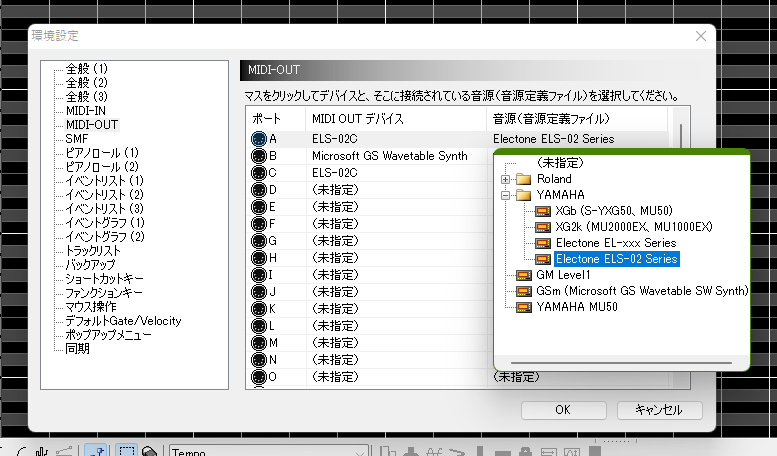
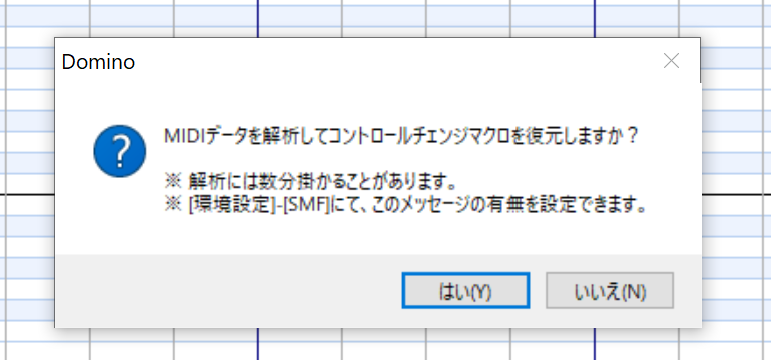

# Domino用 エレクトーン 音源定義ファイル

# [公式サイトはこちらから](https://el.kamekyame.com/tools/domino-define)

Electoneの資源を最大限活用するためのDomino用音源定義ファイルです。

## 特徴

- Electone用のXG拡張音色に対応
- Electone MIDIリファレンスに記載されているメッセージをほぼ網羅
- [ぱるぷ様](http://parupu.chu.jp/)のYAMAHA mu50用定義ファイルとの互換性あり
- スタイルファイル用のSysEx.マクロを搭載

## ダウンロード

ページ上部のボタンからファイルがダウンロードできます。

別のバージョンをダウンロードしたい場合は、「別バージョン」というボタンからダウンロードしたいバージョンを選択してください。

## 使用方法

1. `electone.xml`を`Domino.exe`と同じ位置にある`Module`フォルダ内にコピーする。
1. Dominoを起動する。※すでに起動している場合は再起動が必要
1. （未設定の場合）下記のように「ファイル」→「環境設定」→「MIDI-OUT」、任意のポートの音源を`Electone`に変更する。（YAMAHAフォルダ内にあります。）

## 対応状況

- [x] 音色情報
- [x] ドラムセット情報
  - [x] PC、Bank
  - [x] Tone (ELシリーズは未対応)
- [ ] コントロールチェンジマクロ情報
  - [x] チャンネルメッセージ
  - [x] エクスクルーシブメッセージ
    - [x] ユニバーサルリアルタイムメッセージ
    - [x] ユニバーサルノンリアルタイムメッセージ
    - [ ] XGネイティブ
    - [x] クラビノーバエクスクルーシブ
    - [x] メッセージエクスクルーシブ
    - [x] エレクトーンエクスクルーシブ
- [x] テンプレート情報
  - [x] SEQ.1~4まで点灯
- [x] デフォルトデータ情報

## 注意点

### すでに作成したファイルがある場合

[ぱるぷ様](http://parupu.chu.jp/)のYAMAHA
mu50用定義ファイル（と上位互換のある定義ファイル）をベースに作成している場合は、「環境設定」から音源を変更するだけで対応可能です。

それ以外の定義ファイルをベースにしている場合は、マクロ情報が引き継がれませんので、一度SMFファイル書き出しを行う必要があります。以下の方法で引継ぎを行ってください。（※ただし定義されていないマクロについては引き継がれないため、正しく動作するかはご自分で確認お願いします。）

1. 「ファイル」→「SMFの書き出し」からMIDIファイルの出力を行う。
1. 出力したMIDIファイルを再度Dominoで読み込む。その際に、以下のように「MIDIデータを解析してコントロールチェンジマクロを復元しますか？」と聞かれるので、「はい」を選択する

### コントロールチェンジマクロに関して

Dominoの使用上、可変長のデータを取るメッセージには対応していません。

また、マクロについては、[ぱるぷ様](http://parupu.chu.jp/)が作成されたYAMAHA mu50用定義ファイルをベースに作成しています。
Dominoに標準搭載されているXG2k定義ファイルなどとの互換性はありません。
したがって、使用する音源定義ファイルを作成途中で変更した場合、意図しないメッセージが送信される可能性があるため、注意して使用するようにしてください。

## 参考元

### データ

[ELS XG拡張ボイスリスト - データライブラリ -
音楽制作会社コムコム](http://www.comcom2.com/lib/els_ext_xg_voice_list.html#113)

### xmlスキーム

[音源定義ファイルの仕様](http://5.pro.tok2.com/~mpc/ranzan86/domino/Domino129/Manual/module.htm)

## 不具合・問い合わせ

定義ファイルに関する不具合・追加してほしい機能などありましたら、[GithubのIssue](https://github.com/kamekyame/el-domino_define/issues)または、[すずとものTwitter(@SuzuTomo2001)](https://twitter.com/SuzuTomo2001)までお願いします。

また、このプロジェクトへの参加希望者も募集中です。

## Contributor

- [kamekyame](https://github.com/kamekyame)
- [wakmin](https://github.com/wakmin-oxo)
